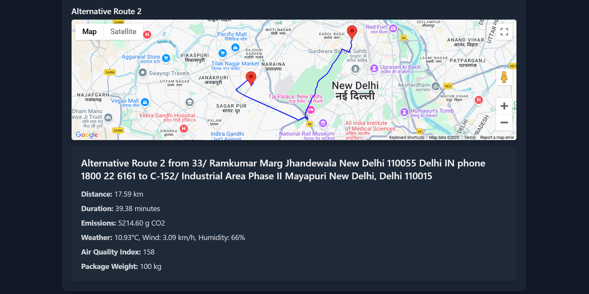

# Route Optimization Flask Application



## 🌟 Overview
The **Route Optimization Flask Application** is a backend service designed to provide eco-friendly route suggestions by leveraging real-time data. The application integrates with multiple APIs to optimize routes based on distance, weather, air quality, and vehicle emissions.

---

## 🚀 Features
- **Multi-Route Comparison**: Fetches and compares multiple routes using the Google Maps API.
- **Real-Time Weather Data**: Integrates with OpenWeather API to factor in weather conditions.
- **Air Quality Index (AQI)**: Uses AQICN API to consider air quality in route optimization.
- **Emission Calculation**: Calculates vehicle emissions based on route data and environmental factors.
- **Customizable Vehicle Types**: Supports various vehicle categories like cars, trucks, vans, and electric vehicles.

---

## 📽️ Demo
Watch the application in action:


[Click here to view the demo](video/demo.mp4) 

---

## 🛠️ Installation

1. **Clone the Repository**
   ```bash
   git clone https://github.com/your-username/route-optimizer.git
   cd route-optimizer
